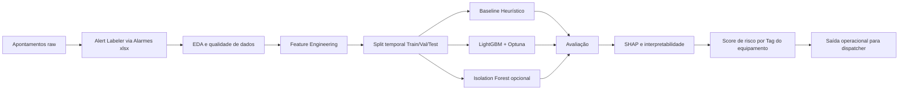

# ⛏️ Mining Fleet Alert Anticipation


Projeto de ciência de dados para antecipação de **alerta Don't Go** em frotas de equipamentos pesados de mineração.
O foco é estimar, em tempo quase real, o risco de um equipamento entrar em condição crítica de operação.
A modelagem utiliza histórico operacional por ciclo, regras de negócio de alarmes e variáveis temporais para prever risco com antecedência.
A janela principal de decisão é uma **janela de predição de 4 horas**, com prioridade para reduzir paradas não planejadas.
A solução é orientada para uso operacional por times de despacho e manutenção preventiva.
---
## Sumário
1. [Visão Geral](#1-visão-geral)
2. [Pergunta Analítica e Métrica de Sucesso](#2-pergunta-analítica-e-métrica-de-sucesso)
3. [Escopo e Fontes de Dados](#3-escopo-e-fontes-de-dados)
4. [Estrutura de Pastas](#4-estrutura-de-pastas)
5. [Arquitetura da Solução](#5-arquitetura-da-solução)
6. [Lógica de Rotulação (Alert Labeler)](#6-lógica-de-rotulação-alert-labeler)
7. [Feature Engineering](#7-feature-engineering)
8. [Estratégia de Validação Temporal](#8-estratégia-de-validação-temporal)
9. [Modelos Implementados](#9-modelos-implementados)
10. [Métricas de Avaliação](#10-métricas-de-avaliação)
11. [Setup e Reprodução](#11-setup-e-reprodução)
12. [Makefile Targets](#12-makefile-targets)
13. [Dependências Principais](#13-dependências-principais)
14. [Controle de Alterações](#14-controle-de-alterações)
15. [Resultados Esperados e Aplicação](#15-resultados-esperados-e-aplicação)
16. [Governança, Qualidade e Boas Práticas](#16-governança-qualidade-e-boas-práticas)
17. [Roadmap Técnico](#17-roadmap-técnico)
18. [Referências](#18-referências)
19. [Anexos Operacionais](#19-anexos-operacionais)
---
## 1. Visão Geral
Este projeto responde a um problema de alta criticidade em mineração: antecipar **alerta Don't Go** para equipamentos de frota.
Um **alerta Don't Go** indica que o equipamento não deve operar devido a condição de risco operacional.
A antecipação permite agir antes da falha crítica, reduzindo risco de segurança, indisponibilidade e impacto produtivo.
A abordagem combina regras de negócio + modelagem estatística + aprendizado de máquina.
O resultado esperado é um score de risco por **Tag do equipamento** para as próximas 4 horas.
### 1.1 Contexto operacional
Ciclos de operação são registrados continuamente por sistema de apontamentos.
Cada novo ciclo adiciona contexto temporal e comportamental sobre uso do equipamento.
Esse fluxo é transformado em dados modeláveis para predição de risco futuro.
### 1.2 Objetivo de produto de dados
Entregar um pipeline reprodutível para:
- ingerir dados brutos;
- rotular eventos críticos;
- construir features robustas;
- treinar modelos de risco;
- disponibilizar saída para apoio à decisão operacional.
---
## 2. Pergunta Analítica e Métrica de Sucesso
### 2.1 Pergunta analítica principal
**Quais equipamentos têm maior risco de gerar um alerta 'Don't Go' nas próximas 4 horas, considerando o padrão atual de operação?**
### 2.2 Scorecard oficial (negócio + técnico)
Critério executivo primário (operacional):
- `Precision@TopK Tag-dia`
- `Recall@TopK Tag-dia`
- `Lift@TopK Tag-dia`

Critério técnico secundário (diagnóstico):
- `AUC-PR`, `Recall`, `Precision`, `AUC-ROC` ciclo-a-ciclo
### 2.3 Critério mínimo de aceite
A solução só é considerada apta para piloto quando funciona como ranking operacional de equipamentos, não apenas como classificador ciclo-a-ciclo.
- `Recall@Top15 Tag-dia >= 0.70` no teste temporal;
- `Precision@Top15 Tag-dia >= 0.60` no teste temporal;
- `Lift@Top15 Tag-dia >= 1.50` contra seleção aleatória;
- consistência de performance em faixas de frota, tipo, turno e região.
### 2.4 Regra de promoção
A promoção final segue `docs/politica_promocao_modelo.md` e exige:
- campeão por validação temporal;
- aprovação no `make gate-stability`;
- metas TopK atendidas no teste;
- avaliação segmentada sem risco oculto em segmento crítico.
---
## 3. Escopo e Fontes de Dados
### 3.1 Fontes oficiais do desafio
| Arquivo | Descrição |
|---|---|
| `Apontamentos.csv` ou `Apontamentos.parquet` | Tabela principal por ciclo de operação (Tag, Frota, Tipo, Modelo, Classe de atividade, Operador, Início, Fim) |
| `business/Alarmes - SUL_SUDESTE.xlsx` | Catálogo de regras de negócio de disparo por combinação `TIPO + EVENTO + SITUACAO + NIVEL` |
| `Dicionario_Dados.xlsx` | Dicionário de variáveis e semântica de colunas |
### 3.2 Princípios de escopo
- Não alterar dados em `data/raw/`.
- Toda transformação deve gerar saída versionável em `data/processed/`.
- Toda exclusão, imputação e regra de negócio deve ser registrada em Change Log.
- Toda avaliação deve respeitar ordem temporal para evitar leakage.
### 3.3 Unidades de análise
- Unidade operacional: ciclo de apontamento.
- Unidade de risco: **Tag do equipamento** em um instante de referência.
- Unidade de decisão: score para **janela de predição de 4 horas**.
---
## 4. Estrutura de Pastas
Estrutura alvo de referência. Quando houver diferença para o repositório atual,
priorizar os caminhos realmente existentes no projeto e atualizar este documento.
```text
mining-fleet-alert-anticipation/
├── README.md                              # Documento central do projeto
├── requirements.txt                       # Dependências fixadas
├── pyproject.toml                         # Configuração de tooling e build
├── .env.example                           # Variáveis de ambiente de exemplo
├── Makefile                               # Orquestração de pipeline
│
├── data/
│   ├── raw/                               # Dados brutos intocados
│   │   ├── apontamentos/
│   │   │   ├── Apontamentos.csv
│   │   │   └── Apontamentos.parquet
│   │   └── alarmes_origem/
│   │       └── Alarmes - SUL_SUDESTE.xlsx
│   ├── processed/                         # Dados limpos + features + target
│   │   ├── labeled/
│   │   │   └── apontamentos_labeled.parquet
│   │   ├── features/
│   │   │   ├── features_train.parquet
│   │   │   ├── features_val.parquet
│   │   │   └── features_test.parquet
│   │   └── scoring/
│   │       └── risk_scores_latest.parquet
│   └── external/                          # Dicionários e insumos auxiliares
│       └── Dicionario_Dados.xlsx
│
├── business/
│   └── Alarmes - SUL_SUDESTE.xlsx         # Regras de negócio de alerta
│
├── notebooks/
│   ├── 00_extracao_head_dados.ipynb       # Exploração inicial da ingestão
│   ├── 01_eda.ipynb                        # Entendimento e qualidade dos dados
│   ├── 02_feature_engineering.ipynb        # Criação e validação de features
│   ├── 03_modeling.ipynb                   # Treino e tuning
│   └── 04_evaluation.ipynb                 # Avaliação temporal e calibração
│
├── src/
│   ├── data_loader.py                      # Leitura e validações de entrada
│   ├── feature_builder.py                  # Construção de features temporais/rolling
│   ├── alert_labeler.py                    # Rotulação do target Don't Go
│   ├── model_trainer.py                    # Treino de modelos e persistência
│   ├── evaluator.py                        # Métricas, curvas, threshold e relatórios
│   ├── inference.py                        # Scoring em novos ciclos
│   └── utils.py                            # Funções utilitárias compartilhadas
│
├── models/
│   ├── baseline_heuristico.pkl             # Artefato do baseline
│   ├── lightgbm_classifier.joblib          # Modelo principal supervisionado
│   ├── isolation_forest.pkl                # Modelo opcional de anomalias
│   └── thresholds.json                     # Threshold calibrado e metadados
│
├── reports/
│   ├── metrics_report.md                   # Relatório consolidado de métricas
│   ├── model_card_lightgbm.md              # Cartão de modelo para governança
│   ├── drift_report.md                     # Monitoramento de drift (quando aplicável)
│   └── figures/
│       ├── eda_distribuicoes.png
│       ├── curva_pr.png
│       ├── curva_roc.png
│       ├── confusion_matrix.png
│       ├── shap_summary.png
│       └── shap_dependence_*.png
│
└── tests/
    ├── test_data_loader.py                 # Testes de ingestão e schema
    ├── test_alert_labeler.py               # Testes da lógica de rotulação
    ├── test_feature_builder.py             # Testes de engenharia de atributos
    ├── test_model_trainer.py               # Testes básicos de treino e persistência
    └── test_evaluator.py                   # Testes de métricas e threshold
```
### 4.1 Convenções de nomenclatura
- arquivos de dados em `snake_case`;
- notebooks com prefixo numérico por etapa CRISP-DM;
- artefatos de modelo com nome explícito de algoritmo;
- relatórios versionáveis em texto (`.md`) + figuras em `reports/figures/`.
---
## 5. Arquitetura da Solução
### 5.1 Fluxo macro
```text
Apontamentos (raw)
    -> Labeling via Alarmes xlsx
    -> EDA
    -> Feature Engineering
    -> Train/Val/Test Split (temporal)
    -> Baseline
    -> Model Training
    -> Evaluation
    -> SHAP Interpretability
    -> Risk Score Output
```
### 5.2 Diagrama Mermaid

### 5.3 Etapas detalhadas
1. **Ingestão**
Carrega os dados de apontamentos sem alteração da fonte.
2. **Rotulação**
Aplica regras de negócio para identificar eventos críticos e construir target futuro.
3. **EDA**
Avalia qualidade, volume, cobertura temporal, classes e anomalias de preenchimento.
4. **Feature Engineering**
Cria variáveis temporais, rolling e derivadas de contexto operacional.
5. **Split temporal**
Separa treino, validação e teste por corte de tempo para evitar leakage.
6. **Treino de baseline**
Define referência mínima de performance sem ML complexo.
7. **Treino do modelo principal**
Treina LightGBM com otimização de hiperparâmetros e foco em recall/AUC-PR.
8. **Avaliação**
Gera métricas, curvas, matriz de confusão e análise por segmentos.
9. **Interpretabilidade**
Utiliza SHAP para explicar drivers de risco por feature e por instância.
10. **Scoring operacional**
Publica score de risco para cada novo ciclo com regra de decisão por threshold.
---
## 6. Lógica de Rotulação (Alert Labeler)
### 6.1 Fonte de regras
A rotulação usa o catálogo `Alarmes - SUL_SUDESTE.xlsx` como referência oficial de negócio.
### 6.2 Regra base de correspondência
Um registro em apontamentos é considerado associado a evento de alerta quando satisfaz combinação equivalente a pelo menos uma linha do catálogo em:
- `TIPO`
- `EVENTO`
- `SITUACAO`
- `NIVEL`
### 6.3 Criticidade foco
Linhas com `NIVEL = "Muito Alto"` representam casos de máxima criticidade.
O projeto prioriza esses casos para definição de **alerta Don't Go** de interesse operacional.
### 6.4 Construção do target binário (janela de 4 horas)
Definição formal do alvo supervisionado:
- Seja `t0` o timestamp do registro atual do ciclo;
- Seja `Tag` a Tag do equipamento associada ao registro;
- Define-se `target_4h = 1` se existir ao menos um alerta crítico para a mesma `Tag` no intervalo `(t0, t0 + 4h]`;
- Caso contrário, `target_4h = 0`.
### 6.5 Tratamento de múltiplos alertas
Se houver mais de um alerta crítico na janela, o target permanece binário `1`.
A contagem de alertas múltiplos pode ser usada como feature auxiliar, não como target principal.
### 6.6 Alternativa de regressão (TTE)
Pode-se modelar também `TTE` (Time To Event), em horas, definido como:
`tte_horas = tempo até próximo alerta crítico para a mesma Tag do equipamento`.
- se houver evento futuro observável: valor contínuo positivo;
- se não houver evento dentro do horizonte de observação: censura à direita (abordagem de sobrevivência).
### 6.7 Qualidade da rotulação
Validações recomendadas:
- cobertura de match entre dados operacionais e catálogo de alarmes;
- taxa de linhas sem match e diagnóstico por coluna;
- coerência temporal entre ciclo e evento;
- auditoria amostral de casos positivos e negativos.
---
## 7. Feature Engineering
### 7.1 Diretrizes gerais
As features são construídas com foco em:
- capturar contexto temporal recente da operação;
- refletir acúmulo de risco por Tag do equipamento;
- representar padrão de uso por Frota, Tipo e Classe;
- manter baixo risco de leakage.
### 7.2 Catálogo de features temporais
Features extraídas de `Inicio` e `Fim`.
| Feature | Tipo | Descrição |
|---|---|---|
| `hora_do_dia` | numérica discreta | Hora (0-23) do início do ciclo |
| `dia_da_semana` | numérica discreta | Dia da semana (0-6) |
| `mes` | numérica discreta | Mês (1-12) |
| `turno` | categórica | Faixa operacional (`manhã`, `tarde`, `noite`) |
| `duracao_ciclo_min` | numérica contínua | Duração do ciclo em minutos (`Fim - Inicio`) |
| `is_fim_de_semana` | binária | 1 se sábado/domingo, 0 caso contrário |
### 7.3 Regras de derivação temporal
- `turno` pode ser mapeado como: manhã `[06:00, 13:59]`, tarde `[14:00, 21:59]`, noite `[22:00, 05:59]`.
- `duracao_ciclo_min` deve ser truncada para valores plausíveis conforme regra de qualidade.
- timestamps devem estar normalizados para o mesmo fuso antes do cálculo.
### 7.4 Features rolling por Tag do equipamento
Janelas móveis por equipamento em 4h, 8h e 24h.
| Feature | Janela | Descrição |
|---|---|---|
| `n_alertas_4h` | 4h | Número de alertas críticos recentes |
| `n_alertas_8h` | 8h | Número de alertas críticos recentes |
| `n_alertas_24h` | 24h | Número de alertas críticos recentes |
| `duracao_media_ciclo_4h` | 4h | Média de duração de ciclo recente |
| `duracao_media_ciclo_8h` | 8h | Média de duração de ciclo recente |
| `duracao_media_ciclo_24h` | 24h | Média de duração de ciclo recente |
| `n_ciclos_4h` | 4h | Quantidade de ciclos recentes |
| `n_ciclos_8h` | 8h | Quantidade de ciclos recentes |
| `n_ciclos_24h` | 24h | Quantidade de ciclos recentes |
| `freq_classe_atividade_4h` | 4h | Frequência relativa da classe de atividade |
| `freq_classe_atividade_8h` | 8h | Frequência relativa da classe de atividade |
| `freq_classe_atividade_24h` | 24h | Frequência relativa da classe de atividade |
| `dias_desde_ultimo_alerta` | variável | Distância temporal desde último alerta crítico |
### 7.5 Features derivadas das regras de negócio
| Feature | Tipo | Descrição |
|---|---|---|
| `n_precondicoes_satisfeitas_4h` | numérica discreta | Contagem de combinações `TIPO + EVENTO` parcialmente atendidas na janela de predição de 4 horas |
| `nivel_maximo_evento_recente` | ordinal | Nível máximo observado recentemente (ex.: baixo, médio, alto, muito alto) |
### 7.6 Features categóricas e encoding
| Variável | Estratégia | Justificativa técnica |
|---|---|---|
| `Tag` | frequency encoding | Alta cardinalidade; preserva sinal de exposição histórica com baixa dimensionalidade |
| `Frota` | one-hot encoding | Cardinalidade moderada e interpretação direta por grupo operacional |
| `Tipo` | one-hot encoding | Cardinalidade controlada e relação semântica estável |
| `Classe` | target encoding | Captura associação com risco sem explosão de dimensão |
| `Operador` | frequency encoding | Alta cardinalidade e anonimização; frequência reduz sparsity |
### 7.7 Cuidados com leakage em encoding
- `target encoding` deve ser ajustado somente no treino.
- Aplicar smoothing e fallback para categorias raras.
- Reaplicar mapeamento no teste sem recalcular média alvo global com dados futuros.
### 7.8 Normalização e imputação
- modelos de árvore geralmente não exigem normalização global;
- valores ausentes devem ser tratados com estratégia consistente por feature;
- imputações devem ser registradas no controle de alterações metodológicas.
### 7.9 Persistência de features
Salvar datasets por split temporal em `data/processed/features/`.
Formato recomendado: `.parquet` com schema validado.
---
## 8. Estratégia de Validação Temporal
### 8.1 Por que não usar k-fold padrão
`k-fold` aleatório mistura passado e futuro, gerando vazamento temporal.
Esse vazamento superestima performance e não representa o cenário real de predição online.
### 8.2 Estratégia adotada
Abordagem recomendada:
- `TimeSeriesSplit` com expansão temporal, ou
- hold-out temporal fixo com cortes cronológicos.
Split sugerido:
- 70% treino;
- 15% validação;
- 15% teste.
### 8.3 Diagrama ASCII do split temporal
```text
Tempo  -------------------------------------------------------------->
[---------------------- TREINO (70%) ----------------------][-- VAL (15%) --][-- TESTE (15%) --]
t0                                                            t_val_start      t_test_start
```
### 8.4 Variante com janelas expansivas
```text
Fold 1: [Treino Jan-Fev] -> [Val Mar]
Fold 2: [Treino Jan-Mar] -> [Val Abr]
Fold 3: [Treino Jan-Abr] -> [Val Mai]
...
```
### 8.5 Regras de integridade temporal
- nenhuma observação do futuro pode influenciar feature do passado;
- rolling windows sempre calculadas até `t0` (exclusivo do futuro);
- threshold final calibrado em validação e congelado antes do teste.
---
## 9. Modelos Implementados
### 9.1 Visão geral
| Modelo | Tipo | Biblioteca | Métrica principal | Artefato serializado |
|---|---|---|---|---|
| Baseline Heurístico | Regra determinística | `pandas` / `numpy` | Recall, AUC-PR | `models/baseline_heuristico.pkl` |
| LightGBM Classifier | Supervisionado (classificação) | `lightgbm`, `scikit-learn` | Recall, AUC-PR | `models/lightgbm_classifier.joblib` |
| Isolation Forest (opcional) | Não supervisionado (anomalia) | `scikit-learn` | AUC-PR proxy via matching com alertas | `models/isolation_forest.pkl` |
### 9.2 Modelo 1 — Baseline Heurístico
Definição:
Score de risco baseado na frequência histórica de alertas por Tag do equipamento nas últimas 24h.
Uso:
- não depende de algoritmo de ML complexo;
- oferece piso de performance;
- fornece benchmark operacional interpretável.
### 9.3 Modelo 2 — LightGBM Classifier
Justificativas:
- alta eficiência em dados tabulares;
- robustez com valores ausentes;
- boa performance em bases desbalanceadas;
- velocidade de treino e inferência favorável para operação.
Hiperparâmetros:
Otimização via Optuna com validação temporal.
Parâmetros típicos a buscar:
- `num_leaves`
- `learning_rate`
- `n_estimators`
- `min_child_samples`
- `subsample`
- `colsample_bytree`
- `reg_alpha`
- `reg_lambda`
- `scale_pos_weight`
### 9.4 Modelo 3 — Isolation Forest (opcional/avançado)
Objetivo:
Detectar desvios do padrão operacional como sinal precursor de risco.
Uso de validação:
Comparar anomalias detectadas com alertas reais como ground truth de referência ex-post.
Limitação:
Pode ter menor precisão operacional isoladamente, mas útil como sinal complementar.
### 9.5 Persistência e versionamento
Cada artefato salvo deve incluir metadados mínimos:
- timestamp de treino;
- faixa temporal usada;
- versão de schema de features;
- versão de dependências.
---
## 10. Métricas de Avaliação
### 10.1 Racional de métricas
Devido ao desbalanceamento entre eventos críticos e não críticos, o foco não deve ser apenas acurácia.
Métricas primárias operacionais:
- `Precision@TopK Tag-dia`;
- `Recall@TopK Tag-dia`;
- `Lift@TopK Tag-dia` contra seleção aleatória;
- volume de alertas por dia.
Métricas técnicas auxiliares:
- `Recall`;
- `AUC-PR`;
- `Precision`;
- `F1-score`;
- `AUC-ROC`.
As métricas ciclo-a-ciclo continuam úteis para diagnóstico técnico, mas não devem ser usadas sozinhas como critério executivo de sucesso.
### 10.2 Custo assimétrico do erro
- **Falso negativo**: alerta Don't Go não detectado, podendo gerar parada crítica não planejada e risco de segurança.
- **Falso positivo**: alerta previsto sem materialização imediata, podendo gerar intervenção preventiva desnecessária com custo operacional menor.
### 10.3 Calibração de threshold
`threshold` de decisão deve ser calibrado na validação temporal, com foco em recall mínimo operacional.
Para operação diária, a recomendação é priorizar ranking `TopK Tag-dia`, pois ele representa melhor a capacidade real do time de manutenção.
Exemplo de processo:
1. gerar curva Precision-Recall na validação;
2. filtrar thresholds com recall acima da meta mínima de segurança;
3. selecionar ponto de melhor compromisso com precisão;
4. congelar threshold e avaliar no teste temporal.
Threshold vigente:
- `threshold_risco = 0.180223`
- `recall_val = 0.8077`
- `precision_val = 0.2112`
### 10.4 Template de reporte de métricas
| Top K Tags/dia | Precision@K | Recall@K | Lift@K | Alertas/dia |
|---:|---:|---:|---:|---:|
| 3 | 0.6667 | 0.1453 | 2.0500 | 3 |
| 5 | 0.6333 | 0.2300 | 1.9475 | 5 |
| 10 | 0.6767 | 0.4915 | 2.0808 | 10 |
| 15 | 0.6689 | 0.7288 | 2.0569 | 15 |
| 20 | 0.6167 | 0.8959 | 1.8963 | 20 |
---
## 11. Setup e Reprodução
### 11.1 Pré-requisitos
- Python 3.11+
- `pip` atualizado
- acesso aos arquivos de dados originais
### 11.2 Passo a passo
```bash
# 1. Clonar o repositório
git clone <repo-url>
cd mining-fleet-alert-anticipation
# 2. Criar ambiente virtual
python -m venv .venv
source .venv/bin/activate  # Windows: .venv\Scripts\activate
# 3. Instalar dependências
pip install -r requirements.txt
# 4. Configurar variáveis de ambiente
cp .env.example .env
# Editar .env com os caminhos corretos dos dados
# 5. Executar pipeline completo
make run-all
# Ou etapa a etapa:
make eda
make features
make train
make evaluate
```
### 11.3 Execução dos testes
```bash
pytest tests/ -v --cov=src
```
### 11.4 Variáveis de ambiente esperadas
Exemplo mínimo em `.env.example`:
```dotenv
RAW_DATA_DIR=./data/raw
PROCESSED_DATA_DIR=./data/processed
BUSINESS_RULES_PATH=./business/Alarmes - SUL_SUDESTE.xlsx
DATA_DICTIONARY_PATH=./data/external/Dicionario_Dados.xlsx
MODEL_DIR=./models
REPORT_DIR=./reports
RISK_THRESHOLD=[a preencher apos calibracao]
```
---
## 12. Makefile Targets
Targets de referência para orquestração do pipeline.
| Target | Descrição | Saída principal |
|---|---|---|
| `make eda` | executa notebook de EDA e salva figuras | `reports/figures/` |
| `make features` | executa feature engineering e salva dataset processado | `data/processed/` |
| `make label` | aplica rotulação via regras de negócio e salva target | `data/processed/labeled/` |
| `make train` | treina modelos e salva artefatos | `models/` |
| `make benchmark` | compara múltiplos modelos supervisionados com split temporal | `reports/model_benchmark_report.*` |
| `make tune-hist-gbdt` | otimiza HistGBDT, gera curva de threshold e backtesting temporal | `reports/hist_gbdt_*` |
| `make evaluate` | gera métricas operacionais TopK, budget e deduplicação | `reports/operational_*` |
| `make evaluate-segments` | avalia métricas por Frota, Tipo, turno, Classe e Tag | `reports/segment_*` |
| `make gate-stability` | valida estabilidade temporal antes da promoção | validação de variância entre folds |
| `make run-all` | pipeline completo em sequência | todos os artefatos acima |
| `make test` | roda testes unitários | relatório de testes |
| `make clean` | remove artefatos gerados mantendo dados raw | limpeza controlada |
### 12.1 Exemplo de convenção de dependências no Makefile
Ordem recomendada:
1. `label`
2. `eda`
3. `features`
4. `train`
5. `benchmark`
6. `tune-hist-gbdt`
7. `gate-stability`
8. `evaluate`
9. `evaluate-segments`
### 12.2 Política de limpeza
`make clean` não deve apagar:
- `data/raw/`
- arquivos originais em `business/`
- dicionários em `data/external/`
---
## 13. Dependências Principais
### 13.1 requirements.txt (versões fixadas)
```txt
# Data
pandas==2.2.2
numpy==1.26.4
pyarrow==15.0.2
# Machine Learning
scikit-learn==1.4.2
lightgbm==4.6.0
optuna==3.6.1
imbalanced-learn==0.12.2
# Interpretabilidade
shap==0.45.1
# Visualização
matplotlib==3.8.4
seaborn==0.13.2
plotly==5.20.0
# Séries Temporais (opcional)
statsmodels==0.14.2
# Qualidade de código
pytest==8.2.0
pytest-cov==5.0.0
black==24.4.2
ruff==0.4.4
```
### 13.2 Dependências opcionais
- `lifelines` para modelagem de sobrevivência com censura em TTE;
- `jupyterlab` para execução interativa de notebooks;
- `python-dotenv` para carregamento de variáveis de ambiente.
---
## 14. Controle de Alterações
### 14.1 Tabela padrão obrigatória
Toda decisão de limpeza, exclusão, imputação ou transformação deve ser registrada com transparência.
| Campo | Problema | Qtd. Registros | Tratamento | Justificativa |
|---|---|---:|---|---|
| [a preencher durante execução] |  |  |  |  |
### 14.2 Regra de registro ANTES e DEPOIS
Para cada alteração relevante:
- **ANTES**: evidência do problema (contagem, percentual, amostra).
- **DEPOIS**: estado final após tratamento.
- **impacto**: efeito esperado em qualidade de modelagem.
### 14.3 Exemplos de eventos que exigem log
- remoção de duplicatas;
- filtragem de ciclos inválidos;
- imputação de colunas críticas;
- consolidação de categorias raras;
- ajustes de timezone e padronização temporal.
---
## 15. Resultados Esperados e Aplicação
### 15.1 Cenário operacional de uso
> "A cada novo ciclo registrado pelo sistema de apontamentos, o modelo calcula um score de risco para o equipamento nas próximas 4 horas. Equipamentos com score acima do threshold calibrado disparam um alerta no painel do dispatcher, que pode acionar a manutenção preventiva antes da parada crítica."
### 15.2 Exemplo de saída de scoring
| Tag | Frota | Score_Risco | Alerta_Previsto | Tempo_Antecipacao_h | Ação Recomendada |
|---|---|---:|---|---:|---|
| CAM-042 | SUL-01 | 0.87 | Sim | 3.2 | Parada imediata para inspeção |
| CAR-011 | SUL-02 | 0.54 | Sim | 6.1 | Manutenção preventiva agendada |
| CAM-007 | SUDE-03 | 0.12 | Não | — | Continuar operação |
### 15.3 Contrato de saída mínimo
Campos recomendados no output de inferência:
- `timestamp_referencia`
- `tag_equipamento`
- `frota`
- `score_risco_4h`
- `threshold_aplicado`
- `alerta_previsto_binario`
- `tempo_antecipacao_estimado_h` (quando disponível)
- `top_features_shap` (opcional para explicação)
### 15.4 Ações orientadas por faixa de risco
| Faixa de score | Interpretação | Ação sugerida |
|---|---|---|
| `>= 0.80` | Risco muito alto | Inspeção imediata e possível retirada de operação |
| `0.50 a 0.79` | Risco alto | Planejamento de intervenção preventiva no curto prazo |
| `0.20 a 0.49` | Risco moderado | Monitoramento reforçado |
| `< 0.20` | Risco baixo | Operação normal com monitoramento padrão |
---
## 16. Governança, Qualidade e Boas Práticas
### 16.1 Rastreabilidade
Cada execução relevante deve registrar:
- hash de commit;
- período de dados usado;
- versão das dependências;
- versão do artefato salvo.
### 16.2 Testes mínimos recomendados
- testes de schema e tipos de colunas de entrada;
- testes da lógica de rotulação por casos sintéticos;
- testes de janelas rolling por Tag do equipamento;
- testes de consistência do pipeline de treino/inferência.
### 16.3 Reprodutibilidade
- fixar `random_state` em treinos e validações comparáveis;
- versionar parâmetros de experimento;
- manter separação entre dados raw e processados.
### 16.4 Observabilidade de modelo
Após entrada em produção, monitorar:
- taxa diária de alerta previsto;
- recall proxy com confirmação operacional;
- drift de distribuição de features;
- variação do score por Frota e Tipo.
### 16.5 Segurança e compliance
- operador deve permanecer anonimizado;
- restringir uso de identificadores sensíveis;
- registrar acessos a dados conforme política interna.
---
## 17. Roadmap Técnico
### 17.1 Fase 1 — Base supervisionada
- consolidar rotulação e baseline;
- entregar LightGBM com avaliação temporal;
- definir threshold operacional inicial.
### 17.2 Fase 2 — Robustez
- ampliar cobertura de testes;
- incluir monitoramento de drift;
- calibrar por Frota/Tipo se necessário.
### 17.3 Fase 3 — Avançado
- incorporar modelos de sobrevivência para TTE;
- combinar score supervisionado e score de anomalia;
- avaliar deployment em streaming near real-time.
### 17.4 Entregáveis por fase
| Fase | Entregável | Status |
|---|---|---|
| Fase 1 | Pipeline rotulado + baseline + LightGBM | `[a preencher]` |
| Fase 2 | Monitoramento + testes ampliados | `[a preencher]` |
| Fase 3 | Modelagem avançada (TTE/anomalias) | `[a preencher]` |
---
## 18. Referências
- `business/Alarmes - SUL_SUDESTE.xlsx` — Catálogo de regras de negócio.
- `Dicionario_Dados.xlsx` — Dicionário de features.
- SHAP documentation: <https://shap.readthedocs.io>
- scikit-learn documentation: <https://scikit-learn.org>
- LightGBM documentation: <https://lightgbm.readthedocs.io>
- Lifelines (modelos de sobrevivência): <https://lifelines.readthedocs.io>
- Optuna: <https://optuna.readthedocs.io>
---
## 19. Anexos Operacionais
### 19.1 Template de Model Card (resumo)
| Campo | Conteúdo |
|---|---|
| Nome do modelo | `lightgbm_classifier_v[a preencher]` |
| Objetivo | Antecipar alerta Don't Go em janela de predição de 4 horas |
| Dados de treino | `[a preencher]` |
| Período de treino | `[a preencher]` |
| Métricas principais | `[a preencher]` |
| Threshold de decisão | `[a preencher]` |
| Limitações conhecidas | `[a preencher]` |
### 19.2 Template de análise por segmento
| Segmento | Recall | AUC-PR | Precision | Observações |
|---|---:|---:|---:|---|
| Frota SUL-01 | [a preencher] | [a preencher] | [a preencher] | [a preencher] |
| Frota SUL-02 | [a preencher] | [a preencher] | [a preencher] | [a preencher] |
| Frota SUDE-03 | [a preencher] | [a preencher] | [a preencher] | [a preencher] |
### 19.3 Template de registro de experimento
| Experimento | Data | Modelo | Janela | Features | Recall Val | AUC-PR Val | Observações |
|---|---|---|---|---|---:|---:|---|
| EXP-001 | [a preencher] | Baseline | 4h | básicas | [a preencher] | [a preencher] | [a preencher] |
| EXP-002 | [a preencher] | LightGBM | 4h | completas | [a preencher] | [a preencher] | [a preencher] |
| EXP-003 | [a preencher] | Isolation Forest | 4h | operacionais | [a preencher] | [a preencher] | [a preencher] |
### 19.4 Checklist de pronto para piloto
| Item | Critério | Status |
|---|---|---|
| Dados | Pipeline de ingestão e validação executando sem erro | `[a preencher]` |
| Rotulação | Alert Labeler auditado por amostra de casos | `[a preencher]` |
| Features | Catálogo implementado e versionado | `[a preencher]` |
| Modelo | LightGBM supera baseline em recall e AUC-PR | `[a preencher]` |
| Threshold | Definido em validação temporal | `[a preencher]` |
| Explainability | SHAP gerado para validação e teste | `[a preencher]` |
| Testes | Cobertura mínima em `src/` | `[a preencher]` |
| Operação | Output disponível para dispatcher | `[a preencher]` |
### 19.5 Glossário
- **alerta Don't Go**: condição crítica em que o equipamento não deve operar.
- **Tag do equipamento**: identificador único do equipamento na base.
- **janela de predição de 4 horas**: horizonte futuro usado para classificação de risco.
- **TTE**: Time To Event, tempo estimado até próximo alerta crítico.
- **leakage**: uso indevido de informação futura no treinamento/validação.
### 19.6 Notas finais de implementação
Este README define a referência técnica e metodológica do projeto.
Quando houver diferença entre estrutura atual e estrutura alvo, priorizar a estrutura alvo nas próximas iterações.
Todo ajuste em dados, feature engineering, validação e threshold deve ser refletido neste documento.
Sem métricas reais consolidadas, manter placeholders explícitos para evitar interpretação indevida.
