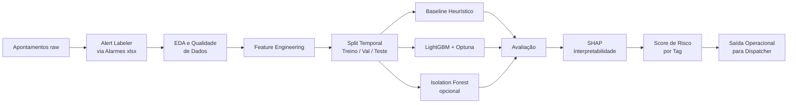

<div align="center">
  <img src="data:image/jpeg;base64,/9j/4AAQSkZJRgABAQAASABIAAD/4QBMRXhpZgAATU0AKgAAAAgAAYdpAAQAAAABAAAAGgAAAAAAA6ABAAMAAAABAAEAAKACAAQAAAABAAAAyKADAAQAAAABAAAAyAAAAAD/7QA4UGhvdG9zaG9wIDMuMAA4QklNBAQAAAAAAAA4QklNBCUAAAAAABDUHYzZjwCyBOmACZjs+EJ+/8AAEQgAyADIAwEiAAIRAQMRAf/EAB8AAAEFAQEBAQEBAAAAAAAAAAABAgMEBQYHCAkKC//EALUQAAIBAwMCBAMFBQQEAAABfQECAwAEEQUSITFBBhNRYQcicRQygZGhCCNCscEVUtHwJDNicoIJChYXGBkaJSYnKCkqNDU2Nzg5OkNERUZHSElKU1RVVldYWVpjZGVmZ2hpanN0dXZ3eHl6g4SFhoeIiYqSk5SVlpeYmZqio6Slpqeoqaqys7S1tre4ubrCw8TFxsfIycrS09TV1tfY2drh4uPk5ebn6Onq8fLz9PX29/j5+v/EAB8BAAMBAQEBAQEBAQEAAAAAAAABAgMEBQYHCAkKC//EALURAAIBAgQEAwQHBQQEAAECdwABAgMRBAUhMQYSQVEHYXETIjKBCBRCkaGxwQkjM1LwFWJy0QoWJDThJfEXGBkaJicoKSo1Njc4OTpDREVGR0hJSlNUVVZXWFlaY2RlZmdoaWpzdHV2d3h5eoKDhIWGh4iJipKTlJWWl5iZmqKjpKWmp6ipqrKztLW2t7i5usLDxMXGx8jJytLT1NXW19jZ2uLj5OXm5+jp6vLz9PX29/j5+v/bAEMAAQEBAQEBAgEBAgMCAgIDBAMDAwMEBgQEBAQEBgcGBgYGBgYHBwcHBwcHBwgICAgICAkJCQkJCwsLCwsLCwsLC//bAEMBAgICAwMDBQMDBQsIBggLCwsLCwsLCwsLCwsLCwsLCwsLCwsLCwsLCwsLCwsLCwsLCwsLCwsLCwsLCwsLCwsLC//dAAQADf/aAAwDAQACEQMRAD8A/gApfekooAOKKKKACl96SigA4ooooAKX3pKKADiiiigApfekooAOKKKKACl96SigA4ooooAKX3pKKADiiiigApfm9P0pKXK+lAH/0P4AKOc0Y9aKADGaM0e1FABRzmjHrRQAYzRmj2ooAKOc0Y9aKADGaM0e1FABRzmjHrRQAYzRmj2ooAKOc0Y9aKADGaM0e1FABRzmjHrRQAYzRmj2ooAKMD1/z+VGPWlwP8n/AOtQB//R/gApfekooAOKKKKACl96SigA4ooooAKX3pKKADiiiigApfekooAOKKKKACl96SigA4ooooAKX3pKKADiiiigApfm9P0pKXK+lAH/0v4AKOc0Y9aKADGaM0e1FABRzmjHrRQAYzRmj2ooAKOc0Y9aKADGaM0e1FABRzmjHrRQAYzRmj2ooAKOc0Y9aKADGaM0e1FABRzmjHrRQAYzRmj2ooAKMD1/z+VGPWlwP8n/AOtQB//T/gApfekooAOKKKKACl96Svd/hL+zN8cfjgPtHw48PXF5aZKm8kxDagr94CWQqjEd1UlvarhTlOSjBXfkc+KxdDDUnXxNRQgt3JpJereh4RxRX6Vy/wDBK39o+LTTfLqGgvLjP2YXM/m59Mm3CZ/4Fj3r44+LP7P3xh+B94lp8TtCn01ZTtjn+WW3kPXCyxlkJxzt3bsdRXRWwGJox5qtNpeaZ5eA4nyjHVfY4TF05z7KSbfot38jxul96SiuQ9wOKKK0dL0jVtcvBp+i2st5cMCRFAhkcgcnhQTxQBnUvvU93aXen3UllfxPDNExV45FKsrDqCDggj0qvQAcUUUUAFL70lFABxRRRQAUvvSUUAHFFFFABS/N6fpSUuV9KAP/1P4AKOc0Y9aKADGaM0e1FABX9NP7DX7Sum/Hz4WRafqCw23iHw+kdrfW0MaQxugH7ueNEAVVkC/MFACurAAAoD/Mtj1r2L4DfGfxP8A/ibp/xH8MkubZtl1b7iqXVs5HmRMeeGAyCQcMA2MivWybMngsQpv4XpL07/I+G8QODqfEWWSw60rQ96m/71tn5S2fnZ9D+t7kttNZ2taHovijS5vD/iOzgv7G5XbNbXKCSKRfRlYMGHAI4IAGDXPfDr4geG/ip4K074heEJvP07VIRNCxI3KTwysFJwyEFGGSFYEEZFdkcsciv1ZOFSF1qmfw5Up18JXcJ3hUg/Rxkn+DTPwd/bF/4J4Xfw+tLn4ofAuOW90WPdJeaVy89mvUvETlpYhzuBy6AZJZdxX4L+BP7Ofx0/aa8aJ8PvgJ4Wv/ABTqz7S8VlFuSFWO0PNK22OGPPG+V1TPU1/WseW9K+yv2R/2nNF/Z38Px/C7U9FhXwx5800TWESxTW73DmSUkKAJVaR2JDfOp+638NflvHeTZjhMFUxnD+HVaqv+Xbly/Nd/8N1fo+h/TXhd4vYatVp5ZxRVcY9KyV9O0/8A5PX+93Pzy/Yp/wCDbDRNONn44/bm1z+0ZsCT/hGNDlaOBe+25vQA78ZBS3CYIyJmHX+mr4P/AAJ+DH7P3hhPBXwT8L6b4W0tAgaDTbdLfeYxgNKyqC7kAku5LMSSSTmofD/7QXwK8Tab/aum+LdNSLbvZLib7NIn+9HJtZa/MT/gpH/wV++E/wCx78L50+E8sXifxpqKmHThg/YopPmBlYkBpPLwPlXEZBA3H7p/hTOKXHHFONeFxVCqtfgcXCnD/FdJad5Xfqz+2cBnHC2X0oVMNiablL4bSU5T9LNt/LRb6I/LL/g5T+On7N88nh74BaboGn6r8T4Wi1C91pRi60nTyGCW7SJgu9yT5nlSErHGN+zdJG4/km5zXe/FH4m+OvjR8Rta+LHxN1B9V8QeIbyW+v7qQBTJNMxZiFUBUUdFRQFRQFUBQBXBV/VvCPD0ckymhlynzOC1fS71duyvsu2+t2fneb5i8di54nlsnsvLp8wxmjNHtRX0h5gUc5ox60UAGM0Zo9qKACjnNGPWigAxmjNHtRQAUYHr/n8qMetLgf5P/wBagD//1f4AKX3pKKADiiiigApfekooA/Sf/gnf+1Mvwh8bH4VeNboReG/EEv7qWQ4W0vWAVWJ7Ry4CPnhTtbIAYn+hk8cCv4v6/ok/4J3/ALUzfGDwR/wrHxncNL4l8OwrtkkbLXdipwshOOXjJVJC3UEMWJY7ftuFs2s/qdR7/D/l8+h/OXjRwI534gwMdV/FXfop/pL5Puz9GqKWo2ZY0ZnYAICWZjgADqSa+6P5kRy3xA8d+F/hf4N1Hx54zuBa6bpcPmzyHBOOAFVSRlnJCKMjcxAAJOK/lj/aK+PPib9oj4l3fj3Xx9ng/wBTY2Ybcltbr91c92P3nbA3MSQAMAfR37ef7Wr/AB98ZDwV4NmI8J6HK3ksP+Xy5GVac4JG0AkRjJ4Jbq2B+fdfmvEWc/WqnsKT/dx/F9/Tsf2R4UeH/wDYuF/tDGx/2qqtv5I/y/4nvLtt0d+3+Hvw48b/ABW8SJ4P+Hunvqepyo0iW8bKrMqctjcQDgc46457Vyuo6dfaRqE+lapE0FzayNFLE42sjodrKR2IIIIrr/hf8RNf+EvxD0f4k+F3232jXUdzGM4DhT8yN/suuVb1Umvu39rn4J2nxC+PnhX4ifDJQNE+LwhvbdlAxDcSFRcAgYxtyJGzzuLDtXzJ+wHwj4j+Gfjjwj4Z0nxh4k097TTtcQyWMrsmZkH8QQNuA9yADkeoqx4O+FHxE+IGh614k8G6VNf2Ph6AXOoyx7cQRHPzEEgnofu5PFe+/trfECw8VfF3/hCvDe1ND8GW6aNZRp90GAASnHY7hsPJzsBr9PPgLremfse/CL4Z/CzX9NWW++K93Jc66ZomkENvcp5UCkAfKQzxKQ2QMSHjOadgPwDrpdV8HeLdD0Wx8R61pd1aafqYY2dzNCyRThMZMbMAGxkZwT1rvv2gPhXe/BX4x6/8NrxWVNOuWEBbq1vJh4jnv8hGcd819lftaFP+GNvgKE/58L3P13JSA/OjQtC1fxPrVr4d8P273d9eyrDBDGMtI7nAUD1Jr3Rf2Sf2kmDbfB2ofKCx+QcAde9Uf2WIxJ+0h4HT11qzH/kQV+i/7R/wj8cy3XjzU7j476atgrahcf8ACPHUHSUxR75FtPID7dwAEYTGM8AHpVJXA/Gyl96SipAOKKKKACl+b0/Skpcr6UAf/9b+ACjnNGPWigAxmjNHtRQAUc5ox60UAGM123w4+IXij4VeN9N+IPg2f7PqOlzCaInO1uzI4BBKOpKsM8qSK4n2opxk001uZ1aUKsJU6ivFppp7NPdP1P65/gb8Y/C3x6+GWnfEjws4VLtds1sWDvbXCcPC/oynkEqN6YcDDcfmj/wUe/a8hsLGf9nT4aXbfaZgU125iOFSJuRaqc5LNn990AGEOSWA/Nn9n39qP4j/ALOUGvW3gp1ePXLQw7JeVguR/q7hRggvGCflPytkbgcDHztfXt7qd7NqWpTPcXFw7SyyyMXeR3OWZmOSSScknqa+px3Es62DjRjpJ/F/wPXr22PxXhrwfw+XZ9UzCtLmoQfNRi9bN/zX/k+z3dpO1rFXGaM0e1FfKn7cFfp3+y3+1/8AD/4a/s8a74F+Ilsl3r3h1p73wg8kRk8ue8R0kRWA+TDMWYlhlXPXAFfmJj1oppgevfBKHwFrPxh0Wf4xaiLPQfti3Gozyo8xkRDvKEKCzeYRtJ9yc19v/GP/AIKcftA33xJ1qP4V61Da+GI7p00yJrOJyLeL5UfMiF8sBuGT8ucADpX5he1FFwPu/wDa9+L3w8/aF8GeCPira6lG3jeKwGneIbTyXiZ3jyUmUhBGVzuzhiQGUYwOPRtW8c/st/F34AfD34d/ELxneaJf+ErOWN4oLGaZTJMQSCfLI4wOVODkk81+ZWPWii4H1bo978EfhJ+0D4O8U/D3xFcazomnXdteXt1PbPC8TRyksFQoGbCgEYU8nFfQ/inw7/wT6+I3jLXvHnif4k6zaXes3dzfGOHTpCqyzuz7R/o5yATjqMjvX5l+1FFwCjnNGPWikAYzRmj2ooAKMD1/z+VGPWlwP8n/AOtQB//X/gApfekooAOKKKKACl96SigA4ooooAKX3pKKADiiiigApfekooAOKKKKACl96SigA4ooooAKX3pKKADiiiigApfm9P0pKXK+lAH/0P4AKOc0Y9aKADGaM0e1FABRzmjHrRQAYzRmj2ooAKOc0Y9aKADGaM0e1FABRzmjHrRQAYzRmj2ooAKOc0Y9aKADGaM0e1FABRzmjHrRQAYzRmj2ooAKMD1/z+VGPWlwP8n/AOtQB//R/gApfekooAOKKKKACl96SigA4ooooAKX3pKKADiiiigApfekooAOKKKKACl96SigA4ooooAKX3pKKADiiiigApfm9P0pKXK+lAH/0v4AKOc0Y9aKADGaM0e1FABRzmjHrRQAYzRmj2ooAKOc0Y9aKADGaM0e1FABRzmjHrRQAYzRmj2ooAKOc0Y9aKADGaM0e1FABRzmjHrRQAYzRmj2ooAKMD1/z+VGPWlwP8n/AOtQB//T/gApfehf60H7ooATiig9BSnv9aAEpfehf60H7ooATiig9BSnv9aAEpfehf60H7ooATiig9BSnv8AWgBKX3oX+tB+6KAE4ooPQUp7/WgBKX3oX+tB+6KAE4ooPQUp7/WgBKX3oX+tB+6KAE4ooPQUp7/WgBKX5vT9KF/rU1AH/9k=" alt="Vale Logo" width="120"/>
  <h1>⛏️ Mining Fleet Alert Anticipation</h1>
  <p><strong>Antecipação de alertas críticos em frotas de mineração com Machine Learning</strong></p>

  
  
  
  
</div>

---

## 📋 Visão Geral

Este projeto endereça um problema de **alta criticidade operacional em mineração**: antecipar o **alerta Don't Go** em equipamentos de frota pesada antes que ele se materialize.

Um **alerta Don't Go** indica que o equipamento não deve operar por apresentar condição de risco iminente. A antecipação com **janela de 4 horas** permite que times de despacho e manutenção preventiva ajam antes da falha crítica — reduzindo risco de segurança, indisponibilidade e impacto produtivo.

A abordagem integra **regras de negócio + modelagem estatística + aprendizado de máquina**, entregando um score de risco por equipamento (`Tag`) atualizado a cada novo ciclo de operação.

### Contexto Operacional

```
Ciclos de operação registrados continuamente
        ↓
Dados transformados em features de risco
        ↓
Score de risco por Tag (próximas 4h)
        ↓
Dispatcher aciona manutenção preventiva
```

---

## 📐 Arquitetura da Solução



---

## 🎯 Pergunta Analítica e Critério de Sucesso

### Pergunta Principal

> **Quais equipamentos têm maior risco de gerar um alerta 'Don't Go' nas próximas 4 horas, considerando o padrão atual de operação?**

### Critério Mínimo de Aceite (Piloto)

| Métrica | Meta |
|---|---|
| `Recall@Top15 Tag-dia` | ≥ 0.70 |
| `Precision@Top15 Tag-dia` | ≥ 0.60 |
| `Lift@Top15 Tag-dia` | ≥ 1.50 vs. seleção aleatória |

A solução é avaliada como **ranking operacional de equipamentos**, não apenas como classificador ciclo-a-ciclo.

---

## 📊 Resultados Consolidados

### Performance no Teste Temporal

| Top K Tags/dia | Precision@K | Recall@K | Lift@K | Alertas/dia |
|---:|---:|---:|---:|---:|
| 3 | 0.6667 | 0.1453 | 2.0500 | 3 |
| 5 | 0.6333 | 0.2300 | 1.9475 | 5 |
| 10 | 0.6767 | 0.4915 | 2.0808 | 10 |
| **15** | **0.6689** | **0.7288** | **2.0569** | **15** |
| 20 | 0.6167 | 0.8959 | 1.8963 | 20 |

> ✅ **Critério de aceite atendido** em Top 15: Recall = 0.73 ≥ 0.70 · Precision = 0.67 ≥ 0.60 · Lift = 2.06 ≥ 1.50

### Threshold Calibrado

| Parâmetro | Valor |
|---|---|
| `threshold_risco` | `0.1802` |
| `recall_val` | `0.8077` |
| `precision_val` | `0.2112` |

---

## 🗂️ Estrutura do Projeto

```text
mining-fleet-alert-anticipation/
├── README.md                              # Documento central do projeto
├── requirements.txt                       # Dependências fixadas
├── pyproject.toml                         # Configuração de tooling
├── Makefile                               # Orquestração do pipeline
│
├── data/
│   ├── raw/                               # Dados brutos — nunca modificar
│   │   ├── apontamentos/
│   │   │   ├── Apontamentos.csv
│   │   │   └── Apontamentos.parquet
│   │   └── alarmes_origem/
│   │       └── Alarmes - SUL_SUDESTE.xlsx
│   ├── processed/                         # Dados limpos, features e target
│   │   ├── labeled/
│   │   ├── features/
│   │   └── scoring/
│   └── external/
│       └── Dicionario_Dados.xlsx
│
├── business/
│   └── Alarmes - SUL_SUDESTE.xlsx         # Regras de negócio (fonte oficial)
│
├── notebooks/
│   ├── 00_extracao_head_dados.ipynb
│   ├── 01_eda.ipynb
│   ├── 02_feature_engineering.ipynb
│   ├── 03_modeling.ipynb
│   └── 04_evaluation.ipynb
│
├── src/
│   ├── data_loader.py
│   ├── feature_builder.py
│   ├── alert_labeler.py
│   ├── model_trainer.py
│   ├── evaluator.py
│   ├── inference.py
│   └── utils.py
│
├── models/
│   ├── baseline_heuristico.pkl
│   ├── lightgbm_classifier.joblib
│   ├── isolation_forest.pkl
│   └── thresholds.json
│
├── reports/
│   ├── metrics_report.md
│   ├── model_card_lightgbm.md
│   ├── drift_report.md
│   └── figures/
│
└── tests/
    ├── test_data_loader.py
    ├── test_alert_labeler.py
    ├── test_feature_builder.py
    ├── test_model_trainer.py
    └── test_evaluator.py
```

---

## 🏷️ Lógica de Rotulação — Alert Labeler

### Fonte das Regras

O catálogo `Alarmes - SUL_SUDESTE.xlsx` é a fonte oficial de regras de disparo, definidas por combinações de `TIPO + EVENTO + SITUACAO + NIVEL`.

### Target Binário — Janela de 4 horas

```
target_4h = 1  →  existe ao menos um alerta crítico para a mesma Tag
                  no intervalo (t0, t0 + 4h]

target_4h = 0  →  nenhum alerta crítico na janela
```

Onde `NIVEL = "Muito Alto"` representa os eventos de **máxima criticidade operacional** (alerta Don't Go).

### Alternativa: Modelagem TTE (Time To Event)

Para horizontes variáveis, é possível modelar `tte_horas` — tempo até o próximo alerta crítico — usando abordagem de **sobrevivência com censura à direita**.

---

## 🔧 Feature Engineering

### Features Temporais

| Feature | Tipo | Descrição |
|---|---|---|
| `hora_do_dia` | numérica | Hora (0–23) do início do ciclo |
| `dia_da_semana` | numérica | Dia da semana (0–6) |
| `turno` | categórica | `manhã` / `tarde` / `noite` |
| `duracao_ciclo_min` | numérica | Duração do ciclo em minutos |
| `is_fim_de_semana` | binária | 1 se sábado/domingo |

### Features Rolling por Tag (janelas de 4h, 8h, 24h)

| Feature | Descrição |
|---|---|
| `n_alertas_0.020833333333333332h` | Alertas críticos recentes |
| `n_ciclos_0.020833333333333332h` | Quantidade de ciclos recentes |
| `duracao_media_ciclo_0.020833333333333332h` | Média de duração de ciclo |
| `freq_classe_atividade_0.020833333333333332h` | Frequência relativa da classe |
| `dias_desde_ultimo_alerta` | Distância temporal desde último alerta crítico |

### Encoding de Variáveis Categóricas

| Variável | Estratégia | Justificativa |
|---|---|---|
| `Tag` | frequency encoding | Alta cardinalidade |
| `Frota` | one-hot encoding | Cardinalidade moderada |
| `Tipo` | one-hot encoding | Relação semântica estável |
| `Classe` | target encoding | Captura associação com risco |
| `Operador` | frequency encoding | Alta cardinalidade, anonimizado |

> ⚠️ **Target encoding** ajustado exclusivamente nos dados de treino, com smoothing para categorias raras.

---

## 📈 Estratégia de Validação Temporal

K-fold aleatório gera **leakage temporal** e superestima a performance real. O projeto adota validação cronológica estrita:

```text
Tempo ──────────────────────────────────────────────────────────>
[──────────── TREINO (70%) ────────────][ VAL (15%) ][ TESTE (15%) ]
t0                                       t_val         t_test
```

**Variante com janelas expansivas:**
```text
Fold 1: [Treino Jan–Fev] → [Val Mar]
Fold 2: [Treino Jan–Mar] → [Val Abr]
Fold 3: [Treino Jan–Abr] → [Val Mai]
```

**Regra de integridade:** rolling windows sempre calculadas até `t0` (exclusivo do futuro).

---

## 🤖 Modelos Implementados

| Modelo | Tipo | Artefato |
|---|---|---|
| Baseline Heurístico | Regra determinística (frequência histórica 24h) | `baseline_heuristico.pkl` |
| **LightGBM** | Supervisionado — classificação binária | `lightgbm_classifier.joblib` |
| Isolation Forest | Detecção de anomalias (complementar) | `isolation_forest.pkl` |

### LightGBM — Modelo Principal

Otimização de hiperparâmetros via **Optuna** com validação temporal. Parâmetros buscados:

`num_leaves` · `learning_rate` · `n_estimators` · `min_child_samples` · `subsample` · `colsample_bytree` · `reg_alpha` · `reg_lambda` · `scale_pos_weight`

---

## 🚦 Interpretação Operacional por Faixa de Risco

| Score | Classificação | Ação Recomendada |
|---|---|---|
| `≥ 0.80` | 🔴 Risco Muito Alto | Inspeção imediata — possível retirada de operação |
| `0.50 – 0.79` | 🟠 Risco Alto | Intervenção preventiva no curto prazo |
| `0.20 – 0.49` | 🟡 Risco Moderado | Monitoramento reforçado |
| `< 0.20` | 🟢 Risco Baixo | Operação normal |

### Exemplo de Saída de Scoring

| Tag | Frota | Score_Risco | Alerta_Previsto | Antecipação (h) | Ação |
|---|---|---:|---|---:|---|
| CAM-042 | SUL-01 | 0.87 | ✅ Sim | 3.2 | Parada imediata para inspeção |
| CAR-011 | SUL-02 | 0.54 | ✅ Sim | 6.1 | Manutenção preventiva agendada |
| CAM-007 | SUDE-03 | 0.12 | ❌ Não | — | Continuar operação |

---

## ⚡ Setup e Reprodução

### Pré-requisitos

- Python 3.11+
- `pip` atualizado
- Acesso aos arquivos de dados originais

### Instalação

```bash
# 1. Clonar o repositório
git clone <repo-url>
cd mining-fleet-alert-anticipation

# 2. Criar ambiente virtual
python -m venv .venv
source .venv/bin/activate        # Windows: .venv\Scripts\activate

# 3. Instalar dependências
pip install -r requirements.txt

# 4. Configurar variáveis de ambiente
cp .env.example .env
# Editar .env com os caminhos dos dados

# 5. Executar pipeline completo
make run-all
```

### Execução por Etapa

```bash
make label       # Rotulação via regras de negócio
make eda         # Análise exploratória
make features    # Feature engineering
make train       # Treino dos modelos
make evaluate    # Métricas operacionais TopK
```

### Testes

```bash
pytest tests/ -v --cov=src
```

---

## 🛠️ Makefile — Targets de Referência

| Target | Descrição | Saída |
|---|---|---|
| `make label` | Rotulação via regras de negócio | `data/processed/labeled/` |
| `make eda` | EDA e figuras | `reports/figures/` |
| `make features` | Feature engineering | `data/processed/features/` |
| `make train` | Treino e persistência de modelos | `models/` |
| `make benchmark` | Comparação de modelos com split temporal | `reports/model_benchmark_report.*` |
| `make tune-hist-gbdt` | Otimização + curva de threshold | `reports/hist_gbdt_*` |
| `make evaluate` | Métricas operacionais TopK | `reports/operational_*` |
| `make evaluate-segments` | Métricas por Frota, Tipo, turno | `reports/segment_*` |
| `make gate-stability` | Validação de estabilidade temporal | validação de variância |
| `make run-all` | Pipeline completo | todos os artefatos |
| `make test` | Testes unitários | relatório de testes |
| `make clean` | Remove artefatos (mantém `raw/`) | limpeza controlada |

---

## 📦 Dependências Principais

```txt
# Data
pandas==2.2.2
numpy==1.26.4
pyarrow==15.0.2

# Machine Learning
scikit-learn==1.4.2
lightgbm==4.6.0
optuna==3.6.1
imbalanced-learn==0.12.2

# Interpretabilidade
shap==0.45.1

# Visualização
matplotlib==3.8.4
seaborn==0.13.2
plotly==5.20.0

# Qualidade de código
pytest==8.2.0
pytest-cov==5.0.0
black==24.4.2
ruff==0.4.4
```

---

## 🗺️ Roadmap Técnico

| Fase | Entregáveis | Status |
|---|---|---|
| **Fase 1** — Base Supervisionada | Rotulação + Baseline + LightGBM + threshold operacional | `[em andamento]` |
| **Fase 2** — Robustez | Monitoramento de drift + testes ampliados + calibração por Frota/Tipo | `[planejado]` |
| **Fase 3** — Avançado | TTE com sobrevivência · Ensemble anomalia+supervisionado · Streaming near real-time | `[planejado]` |

---

## 🏛️ Governança e Boas Práticas

- **Rastreabilidade**: hash de commit + período de dados + versão de dependências por execução
- **Reprodutibilidade**: `random_state` fixado · dados raw intocados · parâmetros versionados
- **Segurança**: operador anonimizado · restrição de identificadores sensíveis
- **Monitoramento pós-produção**: taxa diária de alertas · recall proxy · drift de features · variação de score por Frota/Tipo

---

## 📎 Fontes de Dados

| Arquivo | Descrição |
|---|---|
| `Apontamentos.csv` / `.parquet` | Tabela principal por ciclo — Tag, Frota, Tipo, Modelo, Classe, Operador, Início, Fim |
| `Alarmes - SUL_SUDESTE.xlsx` | Catálogo oficial de regras de disparo por `TIPO + EVENTO + SITUACAO + NIVEL` |
| `Dicionario_Dados.xlsx` | Dicionário de variáveis e semântica de colunas |

---

## 📚 Referências

- [SHAP Documentation](https://shap.readthedocs.io)
- [scikit-learn Documentation](https://scikit-learn.org)
- [LightGBM Documentation](https://lightgbm.readthedocs.io)
- [Lifelines — Survival Analysis](https://lifelines.readthedocs.io)
- [Optuna](https://optuna.readthedocs.io)

---

## 📝 Glossário

| Termo | Definição |
|---|---|
| **Alerta Don't Go** | Condição crítica em que o equipamento não deve operar |
| **Tag do equipamento** | Identificador único do equipamento na base |
| **Janela de predição de 4h** | Horizonte futuro usado para classificação de risco |
| **TTE** | Time To Event — tempo estimado até o próximo alerta crítico |
| **Leakage** | Uso indevido de informação futura no treinamento ou validação |

---

<div align="center">
  <sub>Projeto desenvolvido no contexto operacional de mineração · Vale S.A.</sub>
</div>
