# Relatório de EDA — Etapa 4

## Escopo

Análise exploratória orientada a decisão para o dataset rotulado `apontamentos_labeled.parquet`. O objetivo é explicar a estrutura dos dados, a distribuição do alvo `target_4h` e os principais recortes que sustentam as decisões de modelagem e operação.

`target_4h = 1` representa um ciclo associado a alerta/evento crítico dentro da janela operacional de antecipação de 4 horas, conforme a regra de rotulação do projeto.

## Sumário Executivo

- Registros analisados: `377907`
- Tags únicas: `47`
- Frotas únicas: `5`
- Tipos únicos: `2`
- Positivos target_4h: `70811`
- Taxa de positivos: `18.737679%`

A taxa de positivos indica a prevalência do evento que o modelo precisa antecipar. Como o problema é desbalanceado, as figuras devem ser lidas com atenção a recall, precision, lift e volume operacional de alertas.

## Cobertura temporal

- Início mínimo: `2025-01-01 03:00:00+00:00`
- Início máximo: `2025-07-01 02:57:55+00:00`

A leitura temporal é importante porque o projeto usa validação temporal: o comportamento mais antigo não deve contaminar a avaliação dos períodos mais recentes.

## Duração de ciclo

- Média: `29.6854 min`
- Mediana: `22.9 min`
- P95: `60.0 min`

A diferença entre média, mediana e P95 ajuda a identificar assimetria: quando o P95 fica muito acima da mediana, existe uma cauda de ciclos longos que pode afetar features de tempo e regras de priorização.

## Qualidade de dados (top 5 colunas com mais nulos)

| Coluna | % nulos |
|---|---:|
| next_critical_event_time | 19.3161% |
| tte_horas | 19.3161% |
| Id | 0.0% |
| Inicio | 0.0% |
| Fim | 0.0% |

Os nulos devem ser interpretados pelo papel da coluna. Campos derivados de evento futuro, como `tte_horas`, podem ser nulos quando não há evento crítico associado; já nulos em colunas operacionais básicas exigem revisão de qualidade.

## Como interpretar as figuras

Cada figura abaixo responde a uma pergunta prática. A leitura recomendada é combinar volume, taxa e impacto operacional: uma categoria com muitos positivos pode ser grande apenas porque aparece muito, enquanto uma taxa alta pode representar risco relativo mesmo com menor volume.

### 1. Distribuição do target_4h

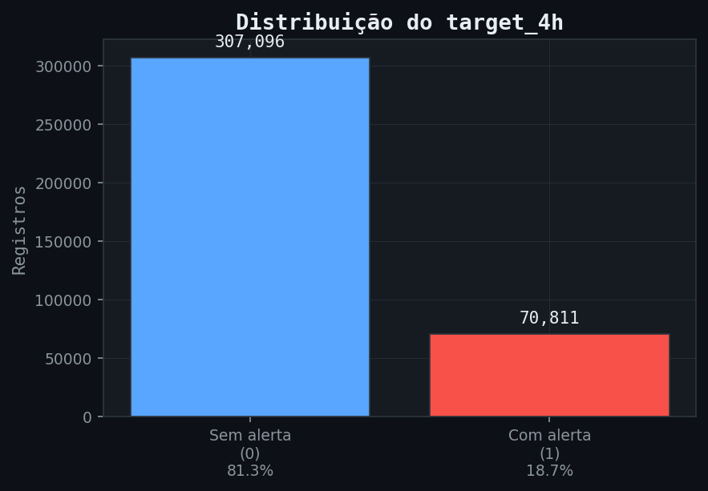

- **Arquivo:** `figures/eda_target_distribution.png`
- **O que mostra:** Compara a quantidade de ciclos sem alerta antecipável (`0`) e com alerta antecipável (`1`).
- **Como ler:** Use para entender o desbalanceamento do problema. Quanto menor a barra de positivos, mais difícil é treinar e avaliar modelos sem métricas específicas para classe rara.
- **Decisão apoiada:** Justifica acompanhar recall, precision, lift e TopK em vez de olhar apenas acurácia.

### 2. Volume de ciclos por hora do dia

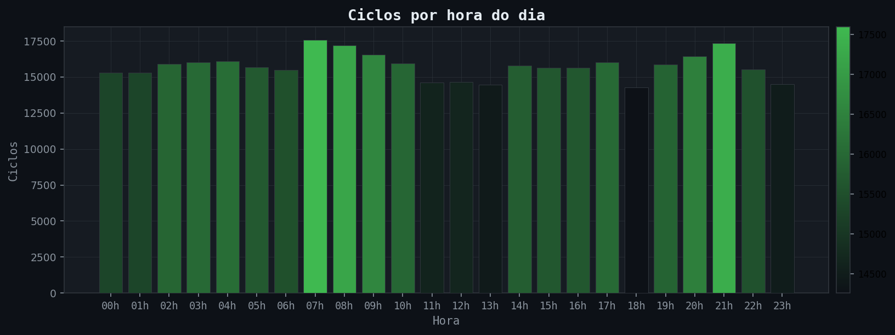

- **Arquivo:** `figures/eda_ciclos_por_hora.png`
- **O que mostra:** Mostra em quais horários os ciclos operacionais se concentram.
- **Como ler:** Picos indicam janelas de maior atividade e possíveis mudanças de turno, carga operacional ou padrão de apontamento.
- **Decisão apoiada:** Ajuda a calibrar análises por hora e a planejar rotinas de inspeção nos períodos de maior volume.

### 3. Top frotas por volume

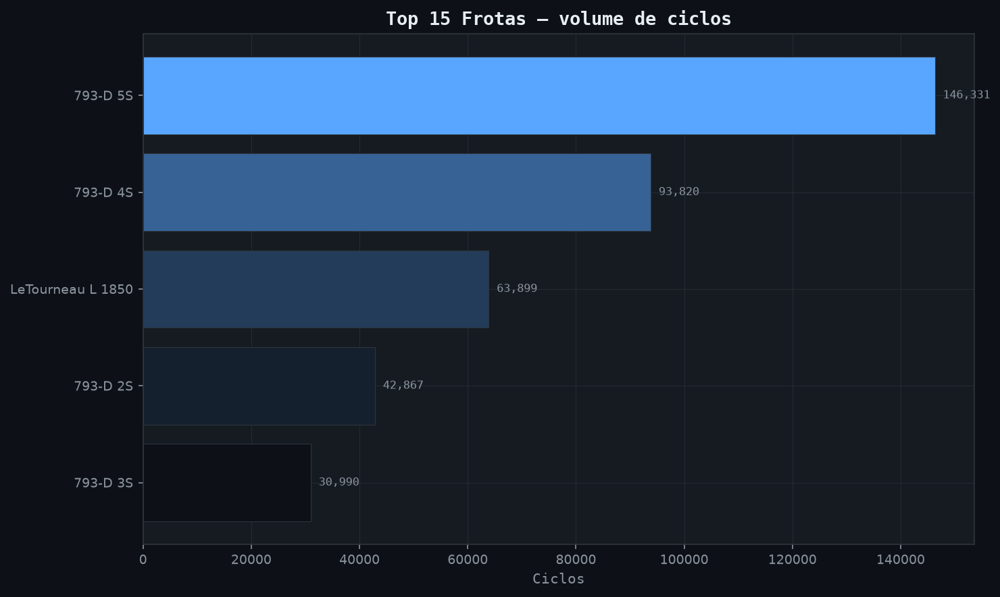

- **Arquivo:** `figures/eda_top_frotas.png`
- **O que mostra:** Lista as frotas com maior quantidade de ciclos registrados.
- **Como ler:** Frotas com mais registros dominam a amostra e podem influenciar estatísticas globais.
- **Decisão apoiada:** Ajuda a separar efeito de volume de efeito de risco antes de priorizar uma frota.

### 4. Distribuição da duração de ciclo

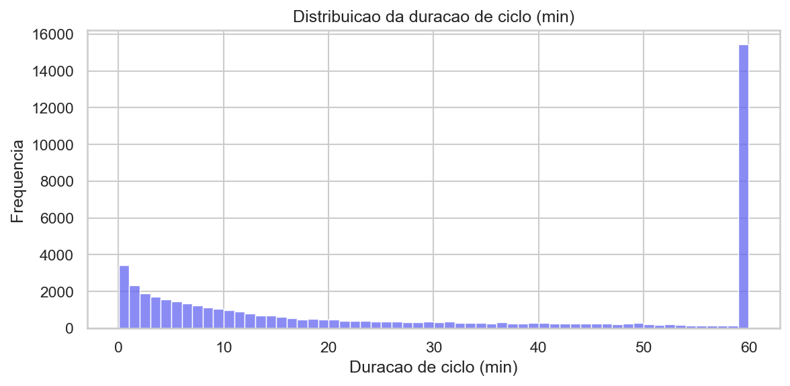

- **Arquivo:** `figures/eda_duracao_ciclo_hist.png`
- **O que mostra:** Histograma da duração dos ciclos em minutos.
- **Como ler:** Caudas longas ou concentrações incomuns podem indicar ciclos atípicos, paradas, atrasos ou problemas de registro.
- **Decisão apoiada:** Apoia regras de tratamento de outliers e validação da coerência temporal entre início e fim do ciclo.

### 5. Top classes de atividade

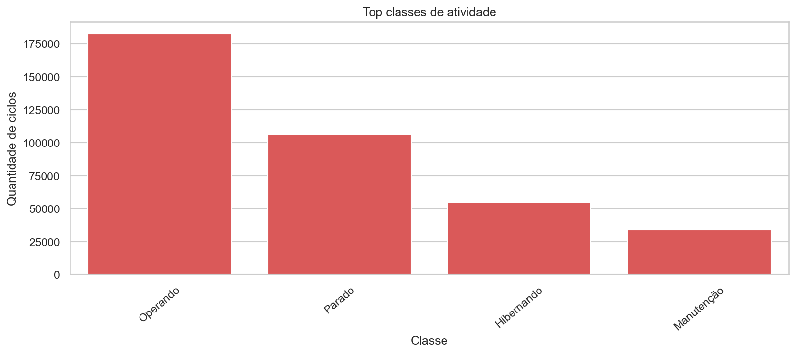

- **Arquivo:** `figures/eda_top_classes.png`
- **O que mostra:** Mostra as classes operacionais mais frequentes no dataset.
- **Como ler:** Classes muito frequentes tendem a ter maior influência no treinamento e na interpretação do modelo.
- **Decisão apoiada:** Ajuda a revisar se as classes mais importantes para a operação estão bem representadas.

### 6. Volume diário e taxa de target_4h

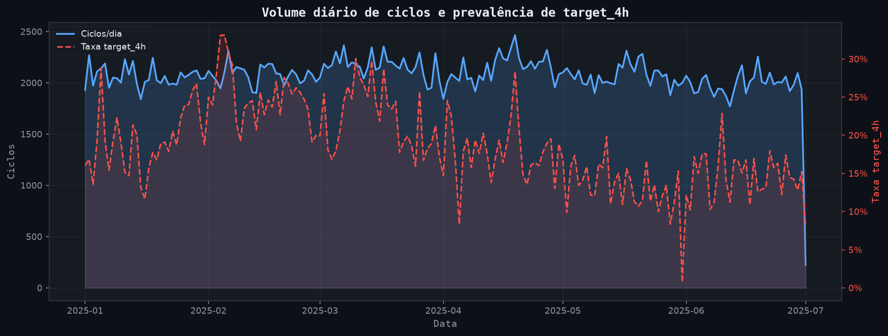

- **Arquivo:** `figures/eda_daily_volume_target_rate.png`
- **O que mostra:** Combina quantidade diária de ciclos com prevalência diária de alertas antecipáveis.
- **Como ler:** Dias com alta taxa de positivos e baixo volume merecem leitura diferente de dias com alto volume e taxa estável.
- **Decisão apoiada:** Ajuda a identificar períodos anômalos, mudanças de regime e risco de avaliação temporal enviesada.

### 7. Taxa de target por hora e dia da semana

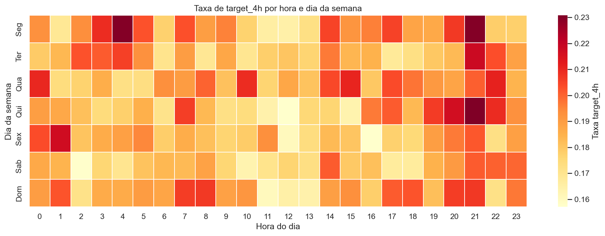

- **Arquivo:** `figures/eda_target_rate_heatmap_hora_dia.png`
- **O que mostra:** Heatmap da taxa média de `target_4h` cruzando dia da semana e hora.
- **Como ler:** Células mais quentes indicam combinações de dia e horário com maior concentração relativa de positivos.
- **Decisão apoiada:** Ajuda a investigar padrões de turno, manutenção, operação e exposição ao risco.

### 8. Tags com mais positivos

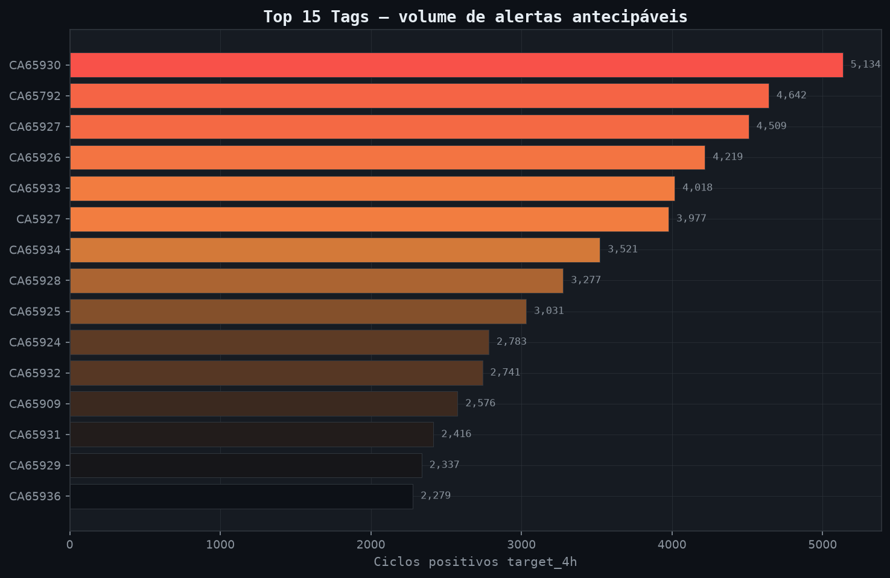

- **Arquivo:** `figures/eda_top_tags_target_positives.png`
- **O que mostra:** Mostra os equipamentos/tags com maior volume absoluto de ciclos positivos.
- **Como ler:** Volume alto de positivos não significa necessariamente maior taxa de risco; pode refletir maior quantidade de ciclos.
- **Decisão apoiada:** Serve como primeira lista de equipamentos para investigação operacional e validação com campo.

### 9. Taxa de target por frota

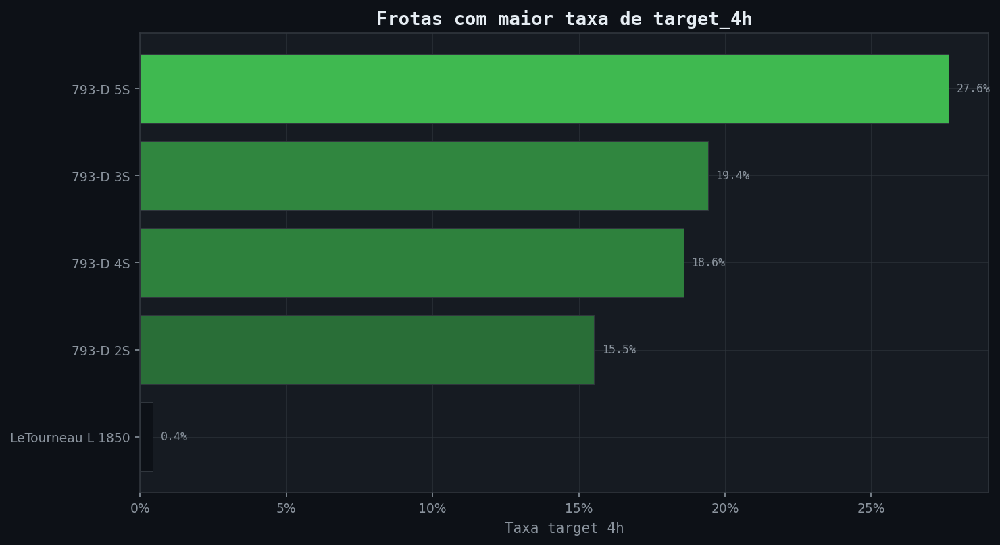

- **Arquivo:** `figures/eda_target_rate_by_frota.png`
- **O que mostra:** Compara frotas pela taxa de ciclos positivos, filtrando grupos com volume mínimo.
- **Como ler:** A leitura é de risco relativo, não de volume absoluto. Uma frota menor pode aparecer no topo se a proporção de positivos for alta.
- **Decisão apoiada:** Ajuda a priorizar investigação de frotas com prevalência acima do padrão geral.

### 10. Taxa de target por tipo e classe

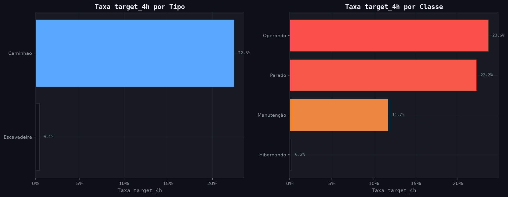

- **Arquivo:** `figures/eda_target_rate_by_tipo_classe.png`
- **O que mostra:** Compara o risco relativo por `Tipo` e por `Classe`.
- **Como ler:** Barras maiores indicam categorias com maior proporção de ciclos positivos, respeitando o volume mínimo configurado.
- **Decisão apoiada:** Ajuda a conectar risco a contexto operacional, tipo de equipamento e classe de atividade.

### 11. Duração por classe de atividade

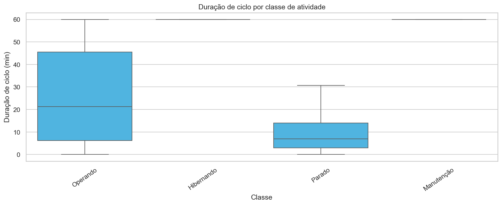

- **Arquivo:** `figures/eda_duracao_por_classe_boxplot.png`
- **O que mostra:** Boxplots de duração de ciclo nas classes mais frequentes.
- **Como ler:** Medianas e dispersões diferentes sugerem que a classe operacional muda o comportamento normal de duração.
- **Decisão apoiada:** Ajuda a validar features temporais e a diferenciar atrasos esperados de comportamentos atípicos.

### 12. Antecedência dos ciclos positivos

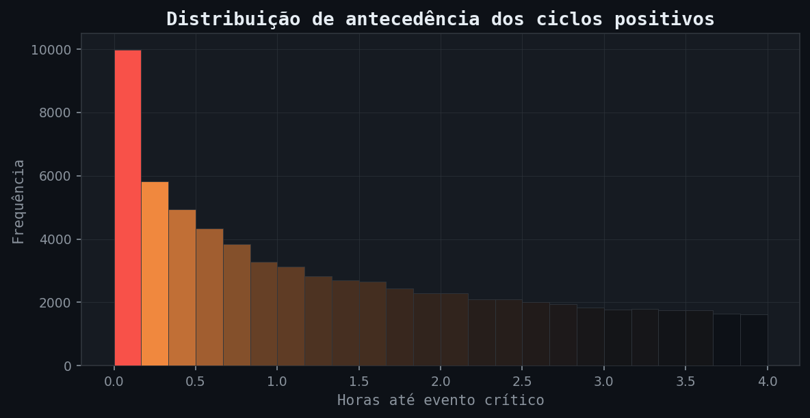

- **Arquivo:** `figures/eda_tte_horas_positivos_hist.png`
- **O que mostra:** Distribuição de `tte_horas` para ciclos positivos, limitada à janela de 4 horas.
- **Como ler:** Mostra quanto tempo antes do evento crítico os ciclos positivos aparecem.
- **Decisão apoiada:** Ajuda a avaliar se a janela de antecipação é operacionalmente útil para gerar ação de campo.

### 13. Percentual de nulos por coluna

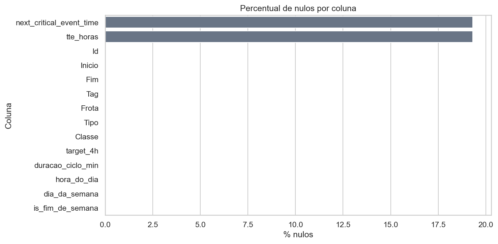

- **Arquivo:** `figures/eda_missing_values.png`
- **O que mostra:** Lista as colunas com maior percentual de valores ausentes.
- **Como ler:** Nulos esperados em variáveis de evento futuro devem ser interpretados diferente de nulos em dados operacionais básicos.
- **Decisão apoiada:** Orienta tratamento de dados, imputação e revisão de qualidade antes da modelagem.

### 14. Correlação entre variáveis numéricas

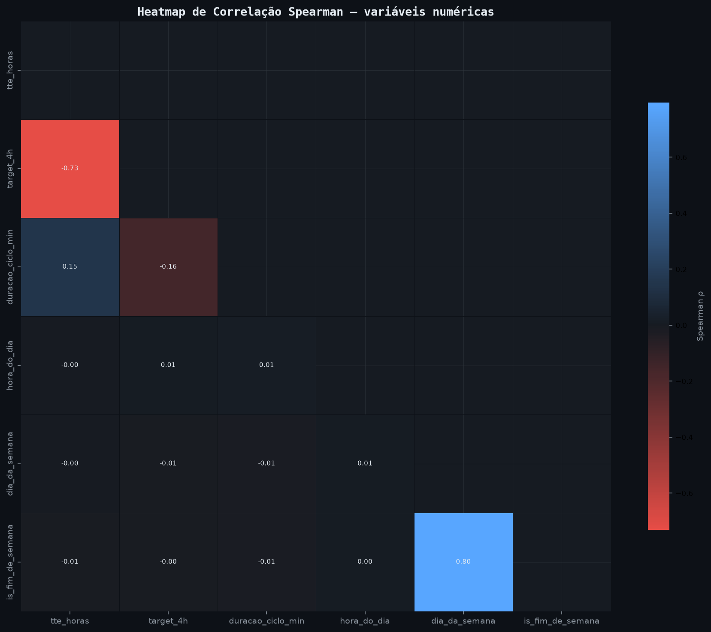

- **Arquivo:** `figures/eda_correlation_heatmap.png`
- **O que mostra:** Heatmap de correlação de Spearman entre variáveis numéricas.
- **Como ler:** Cores fortes indicam relações monotônicas. Correlação alta entre variáveis pode indicar redundância ou vazamento se envolver alvo/futuro.
- **Decisão apoiada:** Ajuda a revisar multicolinearidade, redundância e sinais suspeitos antes do treinamento.

### 15. Diagnóstico de threshold e matriz de confusão

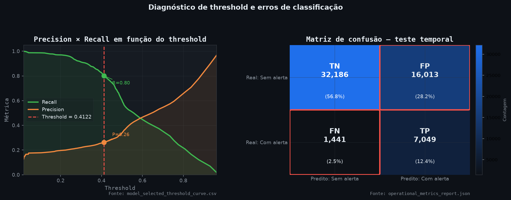

- **Arquivo:** `figures/threshold_diagnostic_confusion_matrix.png`
- **O que mostra:** Une curva Precision/Recall por threshold e matriz de confusão no teste temporal.
- **Como ler:** A linha vertical marca o threshold oficial. A matriz mostra acertos e erros ciclo-a-ciclo: TN, FP, FN e TP.
- **Decisão apoiada:** Explica o trade-off entre capturar positivos e gerar volume de alertas, reforçando a necessidade de priorização TopK.

### 16. Comparação de candidatos em Top15

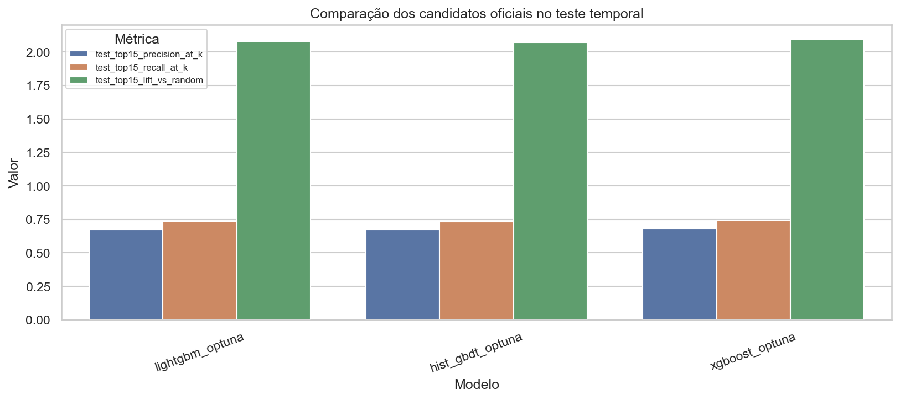

- **Arquivo:** `figures/model_selection_test_top15_metrics.png`
- **O que mostra:** Compara modelos candidatos em Precision@Top15, Recall@Top15 e Lift no teste temporal.
- **Como ler:** Modelos melhores para operação devem equilibrar captura de positivos e qualidade da lista diária priorizada.
- **Decisão apoiada:** Apoia a escolha do modelo oficial sob a métrica mais próxima da rotina de inspeção.

### 17. AUC dos modelos candidatos

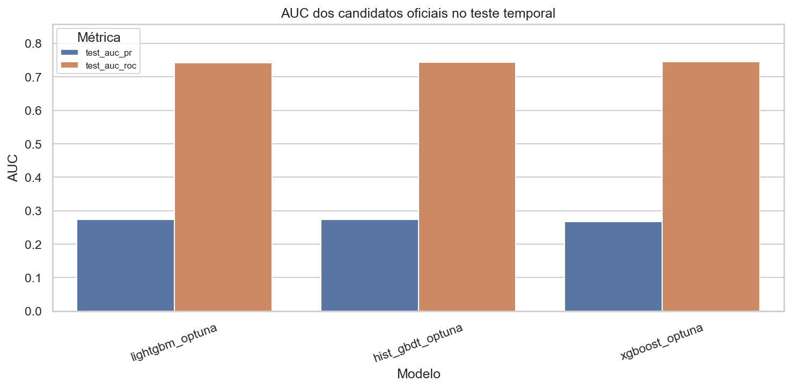

- **Arquivo:** `figures/model_selection_test_auc.png`
- **O que mostra:** Compara AUC-PR e AUC-ROC dos modelos candidatos no teste temporal.
- **Como ler:** AUC-PR é mais informativa quando há desbalanceamento; AUC-ROC ajuda a medir separação geral.
- **Decisão apoiada:** Complementa a decisão de seleção, mas não substitui métricas operacionais TopK.

### 18. Curva operacional TopK

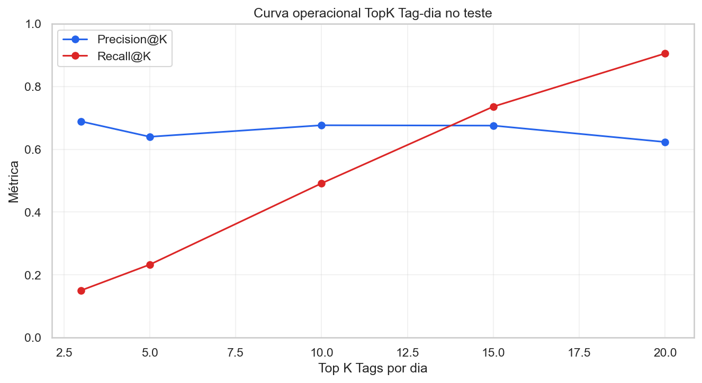

- **Arquivo:** `figures/operational_topk_precision_recall.png`
- **O que mostra:** Mostra Precision@K e Recall@K conforme aumenta o número de tags priorizadas por dia.
- **Como ler:** K maior captura mais positivos, mas tende a reduzir precisão e aumentar carga de inspeção.
- **Decisão apoiada:** Ajuda a escolher um K operacionalmente viável, como Top15 Tag-dia.

### 19. Trade-off por orçamento de inspeção

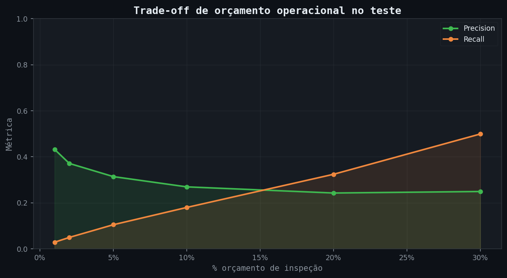

- **Arquivo:** `figures/operational_budget_precision_recall.png`
- **O que mostra:** Mostra precision e recall para diferentes percentuais de orçamento de inspeção.
- **Como ler:** Orçamentos maiores aumentam cobertura, mas podem reduzir qualidade média dos alertas.
- **Decisão apoiada:** Ajuda a alinhar desempenho do modelo com capacidade real de inspeção da operação.

### 20. Desempenho Top15 por segmento

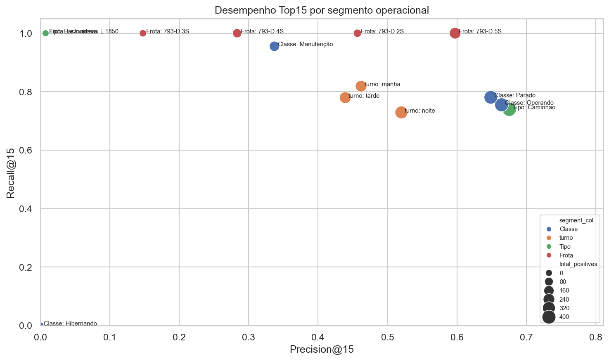

- **Arquivo:** `figures/segments_top15_precision_recall.png`
- **O que mostra:** Compara precision e recall em segmentos operacionais para Top15.
- **Como ler:** Segmentos distantes do padrão geral podem indicar onde o modelo performa melhor ou pior.
- **Decisão apoiada:** Ajuda a direcionar calibração, monitoramento e investigação por frota, tipo, classe ou outro recorte.

## Decisões e próximos passos

1. Monitorar a estabilidade temporal da taxa de `target_4h`, principalmente em dias ou horários com variação forte de volume.
2. Validar com o time operacional as tags, frotas, tipos e classes que aparecem com maior volume ou maior taxa de positivos.
3. Usar as figuras de threshold, TopK e orçamento para escolher um ponto de operação compatível com a capacidade diária de inspeção.
4. Revisar colunas nulas e correlações altas antes de promover novas features ou retreinar modelos.
